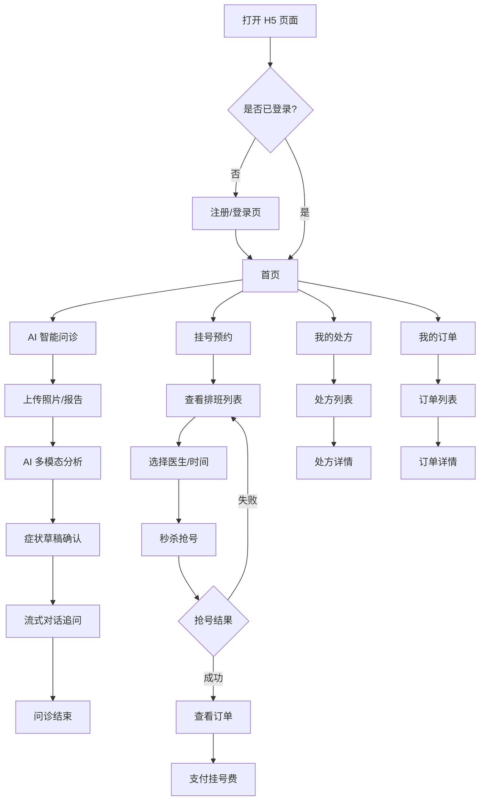
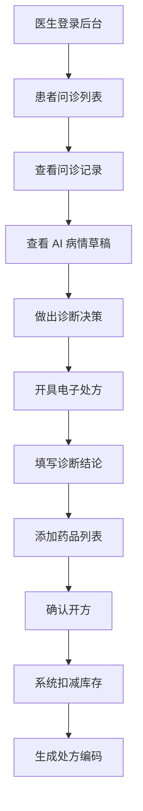
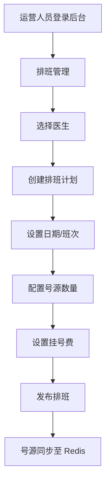
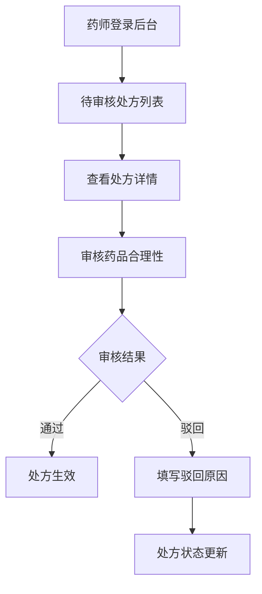
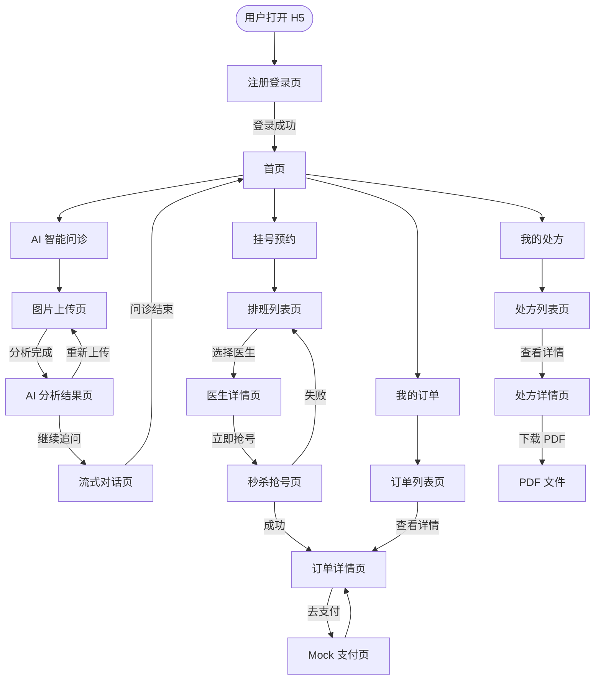
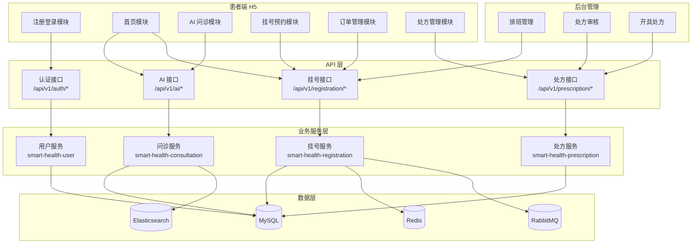
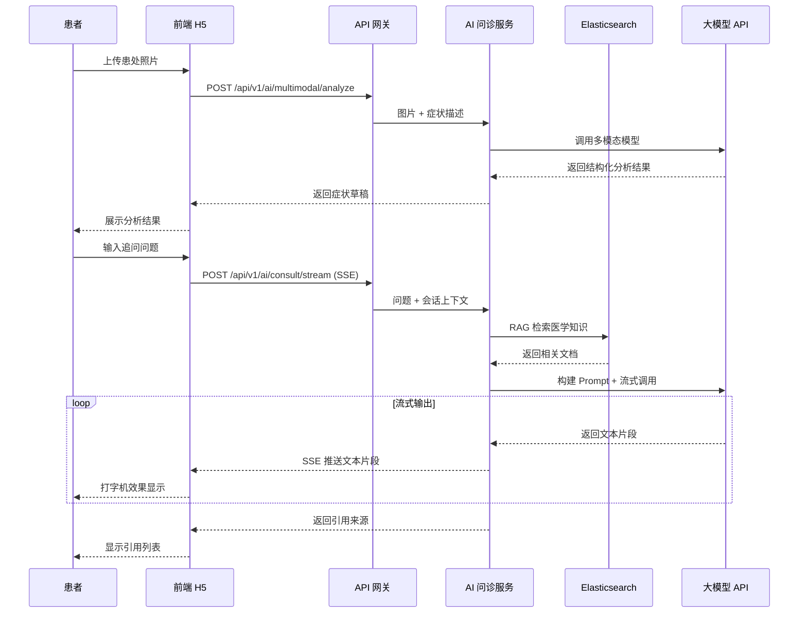
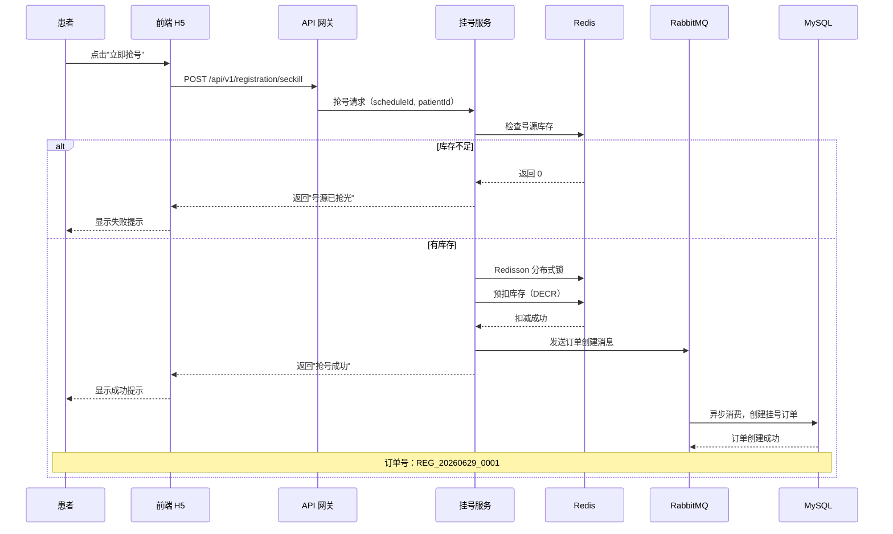
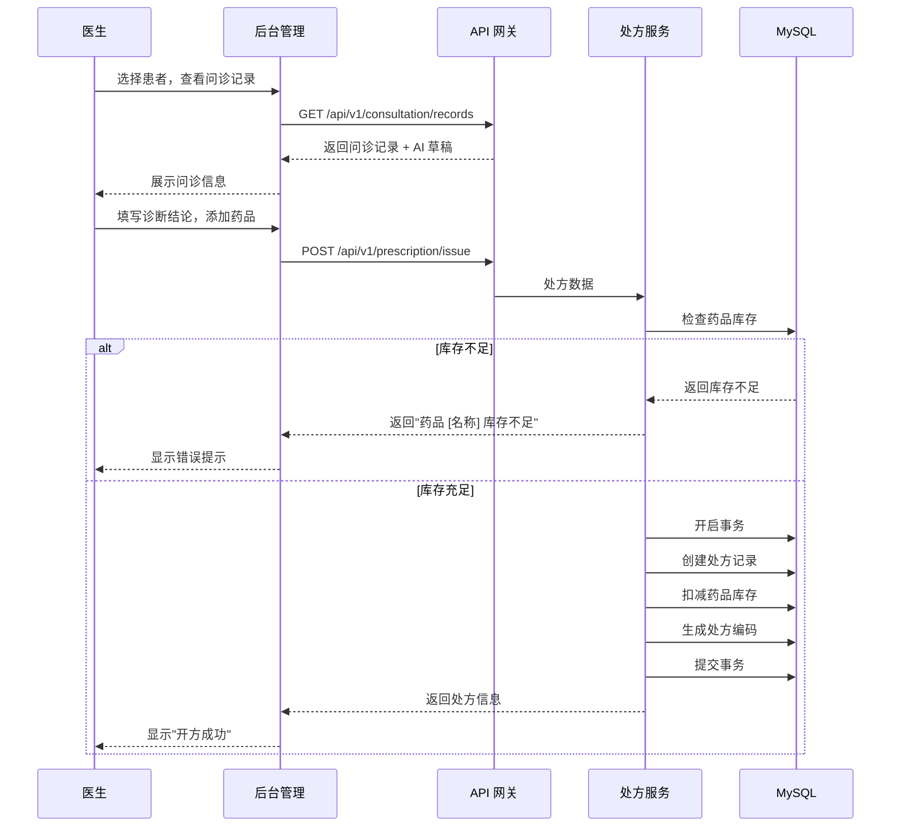

# 智慧医疗与大健康管理平台 — 原型设计初稿

**文档版本**：v1.0  
**创建日期**：2026-06-29  
**文档状态**：初稿  

---

## 一、核心角色与操作路径

### 1.1 角色定义

| 角色 | 职责描述 | 第一阶段范围 |
|------|---------|------------|
| **患者** | 平台 C 端用户，使用挂号、问诊、处方等核心服务 | ✅ 包含 |
| **医生** | 查看问诊记录、开具电子处方 | ⚠️ 仅核心功能 |
| **运营人员** | 管理医生排班计划、号源配置 | ⚠️ 仅排班管理 |
| **药师** | 审核处方（通过/驳回） | ⚠️ 仅审核功能 |
| **系统管理员** | 中间件管理、系统配置 | ✅ 仅运维层面 |

> **说明**：根据 PRD Out of Scope 定义，第一阶段仅实现**患者端 H5 页面**，医生端、运营端、药师端通过 Swagger/Knife4j API 文档或后台管理模板实现最小可用功能。

---

### 1.2 患者核心操作路径



---

### 1.3 医生核心操作路径



---

### 1.4 运营人员核心操作路径



---

### 1.5 药师核心操作路径



---

## 二、关键页面设计

### 2.1 患者端 H5 页面

#### 2.1.1 注册登录页

**页面路径**：`/login`

**功能组件**：
- 📱 手机号输入框（11 位校验）
- 🔐 密码输入框（6-20 位，含字母和数字）
- 📝 注册入口链接
- 🔑 登录按钮
- ⚠️ 错误提示 Toast

**交互逻辑**：
1. 用户输入手机号 + 密码，点击"登录"
2. 前端校验格式 → 调用 `POST /api/v1/auth/login`
3. 成功：返回 JWT Token，存储至 localStorage，跳转首页
4. 失败：显示错误信息（"账号不存在" / "密码错误"）
5. 点击"注册"：跳转注册页，输入手机号 + 密码 + 确认密码 → 调用 `POST /api/v1/auth/register`
6. 注册成功后自动跳转登录页

**数据校验**：
- 手机号：`^1[3-9]\d{9}$`
- 密码：长度 6-20，必须包含字母和数字
- 注册时确认密码需与密码一致

---

#### 2.1.2 首页

**页面路径**：`/home`

**功能组件**：
- 🎯 顶部导航栏（Logo + 用户头像）
- 🔍 搜索框（预留，暂不实现）
- 📋 功能入口卡片：
  - AI 智能问诊（主入口，突出显示）
  - 挂号预约
  - 我的处方
  - 我的订单
- 📢 公告轮播区（预留）
- 🏥 健康资讯列表（预留）

**交互逻辑**：
1. 页面加载时校验 JWT Token 有效性
2. Token 失效 → 跳转登录页
3. 点击功能卡片 → 跳转对应页面
4. 下拉刷新（预留）

---

#### 2.1.3 AI 智能问诊页

**页面路径**：`/consultation`

**子页面**：
- `/consultation/upload` — 图片上传页
- `/consultation/analysis` — AI 分析结果页
- `/consultation/chat` — 流式对话页

##### 2.1.3.1 图片上传页

**功能组件**：
- 📷 拍照按钮（调用摄像头）
- 🖼️ 相册选择按钮
- 📎 图片预览区（支持多图，最多 3 张）
- ❌ 图片删除按钮
- 📝 症状描述输入框（可选，文字补充）
- 🚀 开始分析按钮

**交互逻辑**：
1. 用户选择/拍照图片，支持多图上传
2. 可选填写症状描述文字
3. 点击"开始分析" → 调用 `POST /api/v1/ai/multimodal/analyze`（Multipart/form-data）
4. 显示 Loading 动画（"AI 正在分析您的图片..."）
5. 分析完成 → 跳转分析结果页

##### 2.1.3.2 AI 分析结果页

**功能组件**：
- 🖼️ 已上传图片缩略图
- 📊 症状分析卡片：
  - 主要症状（列表）
  - 可能疾病（列表，带概率）
  - 建议检查项目
  - 注意事项
- ⚠️ 免责声明："以上结果仅供参考，不构成医疗诊断，请及时就医"
- 💬 继续追问按钮
- 🔄 重新上传按钮

**交互逻辑**：
1. 展示 AI 多模态分析结果（结构化 JSON 渲染）
2. 点击"继续追问" → 将分析结果作为上下文，跳转流式对话页
3. 点击"重新上传" → 返回上传页

##### 2.1.3.3 流式对话页

**功能组件**：
- 💬 对话消息列表（气泡样式）：
  - 用户消息（右侧，蓝色）
  - AI 回复（左侧，白色，支持 Markdown 渲染）
- ⌨️ 输入框 + 发送按钮
- 📚 引用来源折叠面板（点击展开）
- 🔄 会话历史列表（侧边栏，可切换）
- ✨ 推荐问题快捷按钮

**交互逻辑**：
1. 页面加载时显示 AI 分析草稿作为首条消息
2. 用户输入问题 → 调用 `POST /api/v1/ai/consult/stream`（SSE）
3. AI 回复以**打字机效果**流式输出（逐字显示）
4. 回复完成后，底部显示"引用来源"（可折叠）
5. 多轮对话上下文自动保持（会话 ID 传递）
6. 点击"推荐问题" → 自动填入输入框并发送
7. 支持创建新会话、切换历史会话

**技术要点**：
- SSE 流式接收，使用 EventSource 或 fetch + ReadableStream
- Markdown 渲染（支持加粗、列表、代码块等）
- 会话 ID 在 URL 参数中传递

---

#### 2.1.4 医生排班与秒杀抢号页

**页面路径**：`/registration`

**子页面**：
- `/registration/schedule` — 排班列表页
- `/registration/doctor/:id` — 医生详情页
- `/registration/seckill/:scheduleId` — 秒杀抢号页

##### 2.1.4.1 排班列表页

**功能组件**：
- 📅 日期选择器（日历视图，显示未来 7 天）
- 🏥 科室筛选下拉框
- 👨‍⚕️ 医生列表卡片：
  - 医生头像
  - 姓名 + 职称（主任医师/副主任医师/主治医师）
  - 科室
  - 擅长领域
  - 可预约日期 + 剩余号源
  - 挂号费
  - "立即预约"按钮

**交互逻辑**：
1. 默认显示今日及未来 7 天排班
2. 选择日期 → 刷新列表，显示该日期可预约医生
3. 点击医生卡片 → 跳转医生详情页
4. 点击"立即预约" → 跳转秒杀抢号页

##### 2.1.4.2 医生详情页

**功能组件**：
- 👨‍⚕️ 医生信息卡片（头像、姓名、职称、科室）
- 📖 医生简介
- 🎯 擅长领域标签
- 📅 排班日历（显示未来 7 天号源情况）
- 💰 挂号费说明
- 🚨 抢号须知（弹窗）
- ⏰ 秒杀倒计时（开抢前显示）
- 🔥 "立即抢号"按钮

**交互逻辑**：
1. 选择日期 → 显示该日期班次（上午/下午/晚上）
2. 选择班次 → 显示剩余号源
3. 点击"立即抢号" → 弹出确认弹窗
4. 确认后 → 调用 `POST /api/v1/registration/seckill`
5. 显示抢号结果（成功/失败/已抢光）

##### 2.1.4.3 秒杀抢号页

**功能组件**：
- 📋 订单确认信息：
  - 医生姓名 + 科室
  - 就诊日期 + 班次
  - 挂号费
- ⏱️ 倒计时（5 分钟支付超时）
- 🔒 提交订单按钮（防重复点击）
- ⚠️ 抢号须知复选框

**交互逻辑**：
1. 用户确认信息无误，勾选须知
2. 点击"提交订单" → 按钮变为 Loading 状态
3. 后端执行：Redis 预扣库存 → Redisson 分布式锁 → RabbitMQ 异步生成订单
4. 返回结果：
   - **成功**：显示订单号（REG_日期_序号），跳转订单详情页
   - **失败**：显示失败原因（"号源已抢光" / "请勿重复抢号" / "系统繁忙"）
5. 成功后订单状态为"待支付"，需在 5 分钟内完成支付

---

#### 2.1.5 挂号订单列表/详情页

**页面路径**：`/orders`

**子页面**：
- `/orders/list` — 订单列表页
- `/orders/detail/:orderId` — 订单详情页

##### 2.1.5.1 订单列表页

**功能组件**：
- 📑 订单状态 Tab：
  - 全部
  - 排队中
  - 待支付
  - 已支付
  - 已就诊
  - 已取消
- 📋 订单卡片列表：
  - 订单号（REG_日期_序号）
  - 医生姓名 + 科室
  - 就诊日期 + 班次
  - 挂号费
  - 订单状态标签（不同颜色）
  - 操作按钮（查看详情/去支付/取消订单）
- 🔄 下拉刷新
- 📄 上拉加载更多

**交互逻辑**：
1. 默认显示"全部"状态订单
2. 点击 Tab → 筛选对应状态订单
3. 点击订单卡片 → 跳转订单详情页
4. "去支付"按钮 → 跳转支付页（Mock 支付）
5. "取消订单"按钮 → 弹出确认弹窗 → 取消订单，释放号源

##### 2.1.5.2 订单详情页

**功能组件**：
- 📊 订单状态进度条：
  - 排队中 → 待支付 → 已支付 → 已就诊
- 📋 订单信息卡片：
  - 订单号
  - 创建时间
  - 医生姓名 + 科室
  - 就诊日期 + 班次
  - 挂号费
- 💳 支付信息卡片（已支付显示）：
  - 支付时间
  - 支付方式
  - 支付流水号
- 🎫 就诊二维码（已支付显示，到院扫码）
- ❌ 取消订单按钮（待支付状态可取消）

**交互逻辑**：
1. 展示订单完整信息和状态流转
2. 待支付状态 → 显示"去支付"按钮
3. 已支付状态 → 显示就诊二维码
4. 已就诊状态 → 显示"查看问诊记录"入口

---

#### 2.1.6 电子处方详情页

**页面路径**：`/prescription`

**子页面**：
- `/prescription/list` — 处方列表页
- `/prescription/detail/:id` — 处方详情页

##### 2.1.6.1 处方列表页

**功能组件**：
- 📋 处方卡片列表：
  - 处方编码（全国唯一）
  - 开具日期
  - 医生姓名 + 科室
  - 诊断结论（摘要）
  - 处方状态（待审核/已审核/已驳回/已取药）
  - 药品数量
- 🔄 下拉刷新
- 📄 上拉加载更多

**交互逻辑**：
1. 按时间倒序展示处方列表
2. 点击处方卡片 → 跳转处方详情页
3. 不同状态用不同颜色标签区分

##### 2.1.6.2 处方详情页

**功能组件**：
- 🏥 处方抬头：
  - 处方编码（大字显示）
  - 开具日期
  - 医院名称
- 👨‍⚕️ 医生信息：
  - 医生姓名 + 职称
  - 科室
- 🤒 诊断信息：
  - 主诉
  - 诊断结论
  - 病情说明（AI 草稿）
- 💊 药品列表：
  - 药品名称
  - 规格
  - 用法用量
  - 数量
  - 单价
- 💰 费用汇总：
  - 药品总金额
  - 诊查费
  - 合计
- 📄 处方 PDF 下载按钮
- ✅ 审核状态（已审核显示药师签名）

**交互逻辑**：
1. 展示处方完整信息
2. 点击"下载 PDF" → 下载处方存根
3. 已审核处方 → 显示药师审核信息和时间

---

### 2.2 后台管理页面（最小可用版本）

> **说明**：后台管理采用 Vue + Element 管理模板，仅实现核心功能，供医生、运营人员、药师使用。

#### 2.2.1 医生排班管理页

**页面路径**：`/admin/schedule`

**功能组件**：
- 📅 排班日历视图
- ➕ 新增排班按钮
- ✏️ 编辑排班按钮
- 🗑️ 删除排班按钮
- 📋 排班列表表格：
  - 医生姓名
  - 日期
  - 班次（上午/下午/晚上）
  - 号源总数
  - 已预约数
  - 剩余号源
  - 挂号费
  - 状态（已发布/已停诊）

**交互逻辑**：
1. 点击"新增排班" → 弹出表单弹窗
2. 填写：选择医生、日期、班次、号源数量、挂号费
3. 提交 → 创建排班，号源同步至 Redis
4. 编辑排班 → 修改号源数量（仅可增加，不可减少）
5. 删除排班 → 软删除，已预约订单不受影响

---

#### 2.2.2 处方审核页

**页面路径**：`/admin/prescription/review`

**功能组件**：
- 📋 待审核处方列表表格：
  - 处方编码
  - 患者姓名
  - 医生姓名
  - 开具时间
  - 操作（审核）
- 🔍 处方详情弹窗：
  - 诊断信息
  - 药品列表
  - 用药合理性提示（AI 辅助）
- ✅ 通过按钮
- ❌ 驳回按钮 + 原因输入框

**交互逻辑**：
1. 点击"审核" → 弹出详情弹窗
2. 查看诊断和药品信息
3. 点击"通过" → 处方状态变为"已审核"
4. 点击"驳回" → 填写驳回原因 → 处方状态变为"已驳回"
5. 审核结果实时通知医生和患者（预留）

---

#### 2.2.3 医生开具处方页

**页面路径**：`/admin/prescription/issue`

**功能组件**：
- 🔍 患者搜索框（按姓名/手机号）
- 📋 患者问诊记录列表：
  - 问诊时间
  - AI 病情草稿
  - 对话记录摘要
- 📝 处方开具表单：
  - 主诉输入框
  - 诊断结论输入框
  - 药品列表（可添加多行）：
    - 药品名称（下拉搜索）
    - 规格（自动填充）
    - 用法用量
    - 数量
  - 诊查费输入
- 💾 暂存按钮
- ✅ 确认开方按钮

**交互逻辑**：
1. 搜索并选择患者
2. 查看该患者问诊记录和 AI 草稿
3. 填写诊断结论
4. 添加药品（从药品库搜索选择）
5. 点击"确认开方" → 系统扣减库存 → 生成处方编码 → 创建 PDF 存根
6. 库存不足 → 提示"药品 [名称] 库存不足"
7. 开方成功 → 处方进入待审核状态

---

## 三、标准用户故事

### 3.1 基础设施与用户认证

| 编号 | 用户故事 | 验收标准 |
|------|---------|---------|
| US-01 | 作为**系统管理员**，我想要**通过 Docker Compose 一键启动所有中间件（MySQL/Redis/RabbitMQ/ES）**，以便**开发环境搭建不超过 5 分钟** | 执行 `docker-compose up -d` 后，所有中间件正常运行，可通过端口访问 |
| US-02 | 作为**患者**，我想要**通过手机号注册账号**，以便**我可以使用平台服务** | 输入合法手机号和密码后，注册成功并自动跳转登录页 |
| US-03 | 作为**患者**，我想要**通过账号密码登录并获取 JWT Token**，以便**后续请求能通过身份认证** | 登录成功后返回 JWT Token，前端存储并自动附加到后续请求头 |
| US-04 | 作为**系统**，我想要**所有 API 请求携带 JWT Token 进行校验**，以便**未认证用户无法访问受保护接口** | 无 Token 或 Token 失效时，返回 401 状态码 |
| US-05 | 作为**开发者**，我想要**统一的 API 响应格式（code/message/data）**，以便**前端和调用方可以统一处理响应** | 所有接口返回格式一致，成功 code=200，失败返回对应错误码 |
| US-06 | 作为**系统**，我想要**全局异常处理，返回结构化错误信息**，以便**调用方可以明确知道错误原因** | 异常返回包含错误码、错误信息、堆栈信息（开发环境） |
| US-07 | 作为**开发者**，我想要**Swagger/Knife4j 接口文档自动生成**，以便**可以通过 UI 调试所有 API** | 访问 `/doc.html` 可查看所有接口并在线调试 |

---

### 3.2 挂号预约（高并发秒杀）

| 编号 | 用户故事 | 验收标准 |
|------|---------|---------|
| US-08 | 作为**运营人员**，我想要**管理医生排班计划（日期、班次、号源量、挂号费）**，以便**患者可以看到可预约的号源** | 创建排班后，号源同步至 Redis，患者端可实时查看 |
| US-09 | 作为**患者**，我想要**查看可预约的医生排班列表**，以便**我可以选择合适的时间挂号** | 按日期筛选，显示医生信息、剩余号源、挂号费 |
| US-10 | 作为**患者**，我想要**参与专家号秒杀抢号**，以便**我能在号源紧张时抢到专家号** | 点击抢号后，1 秒内返回结果（成功/失败） |
| US-11 | 作为**系统**，我想要**使用 Redis 预扣库存 + Redisson 分布式锁防止超卖**，以便**高并发下号源不会被多卖** | 模拟 1000 并发抢 100 个号，最终售出数 = 100 |
| US-12 | 作为**系统**，我想要**抢号成功后通过 RabbitMQ 异步生成挂号订单**，以便**主流程不被数据库写入阻塞，提升吞吐量** | 抢号接口响应时间 < 200ms，订单在 2 秒内生成 |
| US-13 | 作为**患者**，我想要**查看我的挂号订单状态（排队中/待支付/已支付/已就诊）**，以便**我知道就诊进度** | 订单列表实时显示状态，状态流转正确 |
| US-14 | 作为**系统**，我想要**挂号订单号全局唯一（REG_日期_序号）**，以便**订单可追溯** | 订单号格式：REG_20260629_0001，不重复 |

---

### 3.3 AI 智能问诊

| 编号 | 用户故事 | 验收标准 |
|------|---------|---------|
| US-15 | 作为**患者**，我想要**上传患处照片或体检报告截图**，以便**AI 能帮我初步分析症状** | 支持 JPG/PNG 格式，最大 5MB，上传成功后显示预览 |
| US-16 | 作为**系统**，我想要**调用多模态大模型识别图片并生成症状自查草稿**，以便**患者获得结构化的初步分析结果** | 分析结果包含：主要症状、可能疾病、建议检查、注意事项 |
| US-17 | 作为**患者**，我想要**基于症状草稿与 AI 进行多轮追问对话**，以便**我能深入了解自己的病情** | 支持连续对话，AI 能理解上下文 |
| US-18 | 作为**系统**，我想要**通过 RAG 从 Elasticsearch 医学知识库中检索相关内容**，以便**AI 回答基于真实医学文献，减少幻觉** | AI 回答附带引用来源，引用内容与回答相关 |
| US-19 | 作为**系统**，我想要**AI 回答以 SSE 流式方式输出（打字机效果）**，以便**用户无需等待完整回答，体验流畅** | 文字逐字显示，延迟 < 100ms/字 |
| US-20 | 作为**系统**，我想要**AI 回答附带引用来源（指南、说明书等）**，以便**回答可溯源、可信** | 回答底部显示引用列表，点击可查看详情 |
| US-21 | 作为**系统**，我想要**多轮对话上下文保存在会话中**，以便**AI 能理解上下文连贯追问** | 切换会话后，历史对话记录保留 |

---

### 3.4 处方与药品

| 编号 | 用户故事 | 验收标准 |
|------|---------|---------|
| US-22 | 作为**医生**，我想要**查看患者的问诊记录和 AI 生成的病情草稿**，以便**我能做出诊断决策** | 显示问诊时间、AI 草稿、对话摘要 |
| US-23 | 作为**医生**，我想要**为患者开具电子处方（含诊断结论和药品列表）**，以便**患者可以凭处方取药** | 处方包含：诊断结论、药品列表（名称、规格、用法用量、数量） |
| US-24 | 作为**系统**，我想要**开处方时扣减对应院区药房库存**，以便**库存数据实时准确** | 开方后库存实时减少，库存不足时拒绝开方 |
| US-25 | 作为**系统**，我想要**处方生成全国唯一编码和 PDF 存根**，以便**处方可追溯、可存档** | 处方编码格式：RX_医院编码_日期_序号，PDF 可下载 |
| US-26 | 作为**药师**，我想要**审核处方（通过/驳回）**，以便**合理用药得到保障** | 审核通过后处方可取药，驳回需填写原因 |
| US-27 | 作为**患者**，我想要**查看我的处方列表和详情**，以便**我能了解自己的用药情况** | 处方列表按时间倒序，详情显示完整信息 |

---

### 3.5 前端展示

| 编号 | 用户故事 | 验收标准 |
|------|---------|---------|
| US-28 | 作为**患者**，我想要**通过 H5 页面完成注册、登录、上传、问诊、挂号、查看处方的完整流程**，以便**面试/答辩时能端到端演示** | 核心链路可完整走通，无阻断 |
| US-29 | 作为**演示者**，我想要**前端页面简洁美观、流程清晰**，以便**给面试官留下好印象** | 页面加载时间 < 2 秒，无明显 UI Bug |

---

## 四、原型设计页面清单

### 4.1 患者端 H5 页面（共 12 个）

| 序号 | 页面名称 | 页面路径 | 功能描述 | 优先级 |
|------|---------|---------|---------|-------|
| 1 | 注册登录页 | `/login` | 手机号注册、账号密码登录、JWT Token 获取 | P0 |
| 2 | 首页 | `/home` | 功能入口导航、公告轮播、健康资讯 | P0 |
| 3 | 图片上传页 | `/consultation/upload` | 上传患处照片/体检报告，支持拍照和相册 | P0 |
| 4 | AI 分析结果页 | `/consultation/analysis` | 展示多模态分析结果，症状草稿确认 | P0 |
| 5 | 流式对话页 | `/consultation/chat` | SSE 流式对话，打字机效果，引用来源 | P0 |
| 6 | 排班列表页 | `/registration/schedule` | 查看医生排班，按日期/科室筛选 | P0 |
| 7 | 医生详情页 | `/registration/doctor/:id` | 医生信息、排班日历、秒杀倒计时 | P0 |
| 8 | 秒杀抢号页 | `/registration/seckill/:scheduleId` | 订单确认、抢号提交、结果展示 | P0 |
| 9 | 订单列表页 | `/orders/list` | 订单状态筛选、订单卡片列表 | P0 |
| 10 | 订单详情页 | `/orders/detail/:orderId` | 订单完整信息、状态进度条、支付入口 | P0 |
| 11 | 处方列表页 | `/prescription/list` | 处方卡片列表、状态筛选 | P1 |
| 12 | 处方详情页 | `/prescription/detail/:id` | 处方完整信息、药品列表、PDF 下载 | P1 |

---

### 4.2 后台管理页面（共 3 个）

| 序号 | 页面名称 | 页面路径 | 功能描述 | 使用角色 | 优先级 |
|------|---------|---------|---------|---------|-------|
| 1 | 排班管理页 | `/admin/schedule` | 创建/编辑/删除医生排班，号源配置 | 运营人员 | P0 |
| 2 | 处方审核页 | `/admin/prescription/review` | 待审核处方列表、审核通过/驳回 | 药师 | P1 |
| 3 | 开具处方页 | `/admin/prescription/issue` | 查看问诊记录、填写诊断、添加药品、开方 | 医生 | P1 |

---

### 4.3 页面功能矩阵

| 页面 | 数据展示 | 表单输入 | 文件上传 | 流式输出 | 列表筛选 | 弹窗确认 | 状态流转 |
|------|---------|---------|---------|---------|---------|---------|---------|
| 注册登录页 | ❌ | ✅ | ❌ | ❌ | ❌ | ❌ | ❌ |
| 首页 | ✅ | ❌ | ❌ | ❌ | ❌ | ❌ | ❌ |
| 图片上传页 | ✅ | ✅ | ✅ | ❌ | ❌ | ❌ | ❌ |
| AI 分析结果页 | ✅ | ❌ | ❌ | ❌ | ❌ | ❌ | ❌ |
| 流式对话页 | ✅ | ✅ | ❌ | ✅ | ❌ | ❌ | ❌ |
| 排班列表页 | ✅ | ❌ | ❌ | ❌ | ✅ | ❌ | ❌ |
| 医生详情页 | ✅ | ❌ | ❌ | ❌ | ❌ | ✅ | ❌ |
| 秒杀抢号页 | ✅ | ❌ | ❌ | ❌ | ❌ | ✅ | ✅ |
| 订单列表页 | ✅ | ❌ | ❌ | ❌ | ✅ | ✅ | ❌ |
| 订单详情页 | ✅ | ❌ | ❌ | ❌ | ❌ | ✅ | ✅ |
| 处方列表页 | ✅ | ❌ | ❌ | ❌ | ✅ | ❌ | ❌ |
| 处方详情页 | ✅ | ❌ | ❌ | ❌ | ❌ | ❌ | ✅ |
| 排班管理页 | ✅ | ✅ | ❌ | ❌ | ❌ | ✅ | ✅ |
| 处方审核页 | ✅ | ✅ | ❌ | ❌ | ✅ | ✅ | ✅ |
| 开具处方页 | ✅ | ✅ | ❌ | ❌ | ❌ | ✅ | ✅ |

---

## 五、页面跳转逻辑与信息架构

### 5.1 患者端核心页面跳转流程



---

### 5.2 信息架构图



---

### 5.3 核心业务链路时序图

#### 5.3.1 AI 问诊完整链路



---

#### 5.3.2 秒杀抢号完整链路



---

#### 5.3.3 处方开具完整链路



---

## 六、组件设计规范

### 6.1 全局组件

| 组件名称 | 使用场景 | 设计规范 |
|---------|---------|---------|
| **顶部导航栏** | 所有页面顶部 | 高度 44px，白色背景，包含返回按钮、页面标题、右侧操作区 |
| **底部 Tab 栏** | 患者端主页面 | 高度 50px，包含：首页、问诊、挂号、订单、我的 |
| **卡片组件** | 列表项展示 | 圆角 8px，阴影 0 2px 8px rgba(0,0,0,0.1)，内边距 16px |
| **按钮组件** | 操作触发 | 主按钮（蓝色 #1890FF）、次按钮（灰色）、危险按钮（红色） |
| **Toast 提示** | 轻量反馈 | 居中显示，2 秒自动消失，支持成功/失败/警告图标 |
| **Loading 动画** | 加载状态 | 居中旋转图标 + 文字说明 |
| **空状态** | 无数据时 | 图标 + 文字说明 + 操作按钮（可选） |

---

### 6.2 颜色规范

| 用途 | 颜色值 | 说明 |
|------|--------|------|
| **主色调** | #1890FF | 品牌色，用于主按钮、链接、高亮 |
| **成功色** | #52C41A | 成功状态、通过审核 |
| **警告色** | #FAAD14 | 待支付、待审核 |
| **危险色** | #F5222D | 失败、驳回、已取消 |
| **中性色** | #8C8C8C | 次要文字、禁用状态 |
| **背景色** | #F5F5F5 | 页面背景 |
| **卡片背景** | #FFFFFF | 卡片、弹窗背景 |

---

### 6.3 字体规范

| 用途 | 字号 | 字重 |
|------|------|------|
| **大标题** | 20px | Bold |
| **页面标题** | 18px | Bold |
| **卡片标题** | 16px | Medium |
| **正文** | 14px | Regular |
| **辅助文字** | 12px | Regular |
| **数字（金额/号源）** | 16px | Bold |

---

## 七、交互细节说明

### 7.1 加载策略

| 页面类型 | 加载方式 | 说明 |
|---------|---------|------|
| **列表页** | 下拉刷新 + 上拉加载 | 每页 10 条，显示"加载中"/"没有更多了" |
| **详情页** | 骨架屏 | 数据加载完成前显示骨架，提升体验 |
| **图片上传** | 进度条 | 显示上传进度，支持取消 |
| **AI 对话** | 流式加载 | 逐字显示，支持中断 |

---

### 7.2 错误处理

| 错误场景 | 处理方式 |
|---------|---------|
| **网络异常** | Toast 提示"网络连接失败，请检查网络" |
| **Token 失效** | 跳转登录页，提示"登录已过期，请重新登录" |
| **接口超时** | Toast 提示"请求超时，请稍后重试" |
| **服务器错误** | Toast 提示"系统繁忙，请稍后重试" |
| **表单校验失败** | 输入框下方显示红色错误提示 |
| **抢号失败** | 弹窗显示失败原因，提供"再试一次"按钮 |

---

### 7.3 权限控制

| 页面/功能 | 访问权限 | 未授权处理 |
|---------|---------|-----------|
| **注册登录页** | 公开 | - |
| **首页及所有业务页面** | 需登录 | 跳转登录页 |
| **后台管理页面** | 需登录 + 角色权限 | 跳转 403 页面 |

---

## 八、技术实现要点

### 8.1 前端技术栈

- **框架**：Vue 3 + Composition API
- **UI 库**：Element Plus（后台）+ Vant（H5）
- **状态管理**：Pinia
- **路由**：Vue Router 4
- **HTTP 请求**：Axios（封装拦截器，自动附加 Token）
- **SSE 流式**：EventSource API 或 fetch + ReadableStream
- **Markdown 渲染**：marked + highlight.js
- **图片上传**：Element Plus Upload / Vant Uploader

---

### 8.2 关键交互实现

#### 8.2.1 SSE 流式对话

```javascript
// 伪代码示例
const eventSource = new EventSource('/api/v1/ai/consult/stream', {
  headers: { 'Authorization': `Bearer ${token}` }
});

eventSource.onmessage = (event) => {
  const data = JSON.parse(event.data);
  if (data.type === 'content') {
    appendToMessage(data.content); // 逐字追加
  } else if (data.type === 'reference') {
    showReferences(data.references);
  } else if (data.type === 'done') {
    eventSource.close();
  }
};
```

---

#### 8.2.2 秒杀抢号防重复提交

```javascript
// 伪代码示例
let isSubmitting = false;

async function seckill(scheduleId) {
  if (isSubmitting) return;
  isSubmitting = true;
  
  try {
    const response = await api.post('/api/v1/registration/seckill', { scheduleId });
    if (response.code === 200) {
      showToast('抢号成功');
      router.push(`/orders/detail/${response.data.orderId}`);
    } else {
      showToast(response.message);
    }
  } finally {
    isSubmitting = false;
  }
}
```

---

### 8.3 性能优化

| 优化点 | 实现方式 |
|-------|---------|
| **首屏加载** | 路由懒加载、组件按需引入 |
| **图片上传** | 压缩至 1MB 以下再上传 |
| **列表滚动** | 虚拟滚动（长列表） |
| **AI 对话** | 消息分页加载，历史消息懒加载 |
| **静态资源** | CDN 加速、Gzip 压缩 |

---

## 九、验收标准

### 9.1 功能验收

- [ ] 患者可完成注册、登录全流程
- [ ] 患者可上传图片，获得 AI 多模态分析结果
- [ ] 患者可与 AI 进行多轮流式对话，打字机效果流畅
- [ ] 患者可查看医生排班，参与秒杀抢号
- [ ] 抢号成功后生成订单，订单状态正确流转
- [ ] 患者可查看处方列表和详情
- [ ] 运营人员可管理医生排班
- [ ] 医生可查看问诊记录并开具处方
- [ ] 药师可审核处方

---

### 9.2 性能验收

- [ ] 页面首屏加载时间 < 2 秒
- [ ] AI 流式对话延迟 < 100ms/字
- [ ] 秒杀抢号接口响应时间 < 200ms
- [ ] 并发 1000 请求，库存不超卖

---

### 9.3 体验验收

- [ ] 页面简洁美观，符合医疗行业调性
- [ ] 交互流畅，无明显卡顿
- [ ] 错误提示清晰，用户可理解
- [ ] 核心链路可端到端演示

---

## 十、附录

### 10.1 术语表

| 术语 | 说明 |
|------|------|
| **SSE** | Server-Sent Events，服务器推送事件，用于流式输出 |
| **RAG** | Retrieval-Augmented Generation，检索增强生成 |
| **JWT** | JSON Web Token，身份认证令牌 |
| **Redisson** | Redis 分布式锁实现库 |
| **RabbitMQ** | 消息队列，用于异步处理 |
| **Elasticsearch** | 分布式搜索引擎，用于 RAG 检索 |
| **多模态** | 支持文本、图片等多种输入形式的 AI 模型 |

---

### 10.2 参考资料

- PRD 文档：`/home/muxin/codebase/project/PRD.md`
- API 接口文档：`/doc.html`（Knife4j）
- 技术架构设计：项目根目录架构文档

---

**文档结束**
