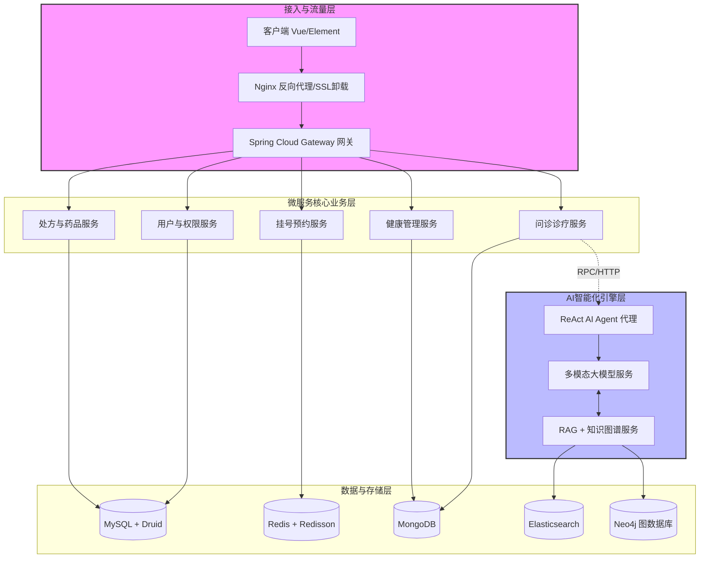

##  业务架构图（Business Architecture）


```

========================================================================================================

                                智慧医疗与大健康管理平台 - 业务架构

========================================================================================================


【用户触达层】 

  └── 患者端（Vue/H5/小程序）：预约挂号、智能自查、图文问诊、慢病管理、电子处方查看、药品商城

  └── 医生端（Vue/PC工作台）：接诊分诊、病历调阅、模拟处方开具、健康数据监控

  └── 药师/运营端：处方审核、药品库存管理、排班管理、AI 知识库维护


--------------------------------------------------------------------------------------------------------

【大健康场景创新层】

  ├── [多模态医学创新] ── 患处图生报告 / 体检报告 OCR 识别 ── 智能生成“症状自查描述草稿”

  ├── [精准智能问诊]   ── RAG 慢病全书 ── 专家文献库检索 ── 流式（SSE）追问互动

  └── [AI全科医生代理] ── ReAct 决策引擎 ── 历史病历调阅 ── 病情评估 ── 自动触发挂号/处方流转

  

--------------------------------------------------------------------------------------------------------

【核心互联网医院业务层】

  ├── [预约挂号核心]：专家号源秒杀、排班计划、动态号池管理

  ├── [问诊诊疗核心]：在线图文/视频问诊、电子病历（EMR）管理、智能分诊

  └── [医药流通核心]：处方流转系统、合理用药审核（风控）、多院区药房库存、药品结算

  

--------------------------------------------------------------------------------------------------------

【大健康管理与基础支撑层】

  ├── [健康管理]：慢病随访、体检报告管理、健康数据（血糖/血压）流式监测

  └── [运营支撑]：统一身份认证、医保/自费结算、统一支付通道、消息中心（通知/提醒）


========================================================================================================

```
### 系统架构图 （System Architecture）


```
     智慧医疗与大健康管理平台 - 后端系统架构

====================================================================================================================


【接入与流量层】

    客户端 (Vue + Vue-router + Element + Axios) 

       └──  Nginx (反向代理、静态资源分发、SSL卸载)

             └──  Spring Cloud Gateway (微服务网关：路由转发、SpringSecurity+JWT鉴权、Sentinel限流降级)


--------------------------------------------------------------------------------------------------------------------

【微服务核心业务层】（基于 Spring Boot 扩展，使用 Nacos 注册与配置中心，Feign/RPC 通信）


   [用户与权限服务]          [挂号预约服务]           [问诊诊疗服务]           [处方与药品服务]          [健康管理服务]

   • SpringSecurity + JWT  • 高并发秒杀控制       • 诊疗流程控制         • 处方审核风控         • 慢病体检数据流

   • Hutool / Lombok       • Redisson 分布式锁    • SpringDoc 接口文档    • Seata 分布式事务     • PageHelper 分页

   • Druid 数据库连接池     • RabbitMQ 异步履约    • WebSocket 实时沟通    • Druid 连多院区库     • MongoDB 存储打卡


--------------------------------------------------------------------------------------------------------------------

【AI 智能化引擎层】（由业务服务通过 RPC / HTTP 调用）


   [多模态大模型服务] ──────────── [RAG + 知识图谱服务] ──────────── [ReAct AI Agent 代理]

   • 患处图片/报告 OCR 识别      • 诊疗指南/说明书嵌入(Vector)     • 全科医生多阶段决策

   • 提示词工程 (Prompt)         • Elasticsearch 向量/文本检索     • 动态调度微服务(工具调用)

   • 自动生成结构化病情草稿      • 图数据库 (Neo4j) 医学图谱验证    • SSE (Server-Sent Events) 流式响应


--------------------------------------------------------------------------------------------------------------------

【数据与存储层】

   ├── 关系型数据库 (MySQL + Druid): 存储核心业务数据 (用户、病历、挂号、处方) -> 通过 MyBatis / Generator 开发

   ├── 缓存/并发层 (Redis + Redisson): 专家号源库存、Token缓存、分布式锁

   ├── 搜索引擎 (Elasticsearch): 慢病文献、医学百科、药品说明书检索

   ├── 非关系型数据库 (MongoDB): 存储患者健康监测流水、非结构化诊疗日志

   └── 对象存储 (MinIO / 阿里云 OSS): 存储患处照片、体检报告截图、电子处方 PDF


--------------------------------------------------------------------------------------------------------------------

【医疗级高可用运维与 AIOps 层】

   ├── 运维底座：Docker 容器化部署、Jenkins 自动化流水线 (CI/CD)

   ├── 统一日志链路：业务日志/应用日志 ──> Logstash 收集 ──> Elasticsearch 存储 ──> Kibana 可视化

   └── AI 智能运维 (AIOps)：AI 异常检测引擎实时消费 ELK 日志，秒级识别系统慢查询、处方异常，触发 Sentinel 自动熔断
```
### File 1: api_design_docs.mdMarkdown
```markdown
# 智慧医疗与大健康管理平台 - 接口设计文档 (API Design Document)

## 1. 规范与通用标准
- **接口风格**: RESTful API
- **认证方式**: JWT 认证，请求时需在 Header 中携带 `Authorization: Bearer <token>`
- **数据交互格式**: `application/json;charset=utf-8` (大模型流式响应接口除外)
- **通用响应格式**:
```json
{
  "code": 200,
  "message": "操作成功",
  "data": {}
}
2. 智能问诊服务 (AI Consultation Service)2.1 提交多模态患处/报告分析 (异步生成草稿)接口路径: /api/v1/ai/multimodal/analyze请求方法: POST接口描述: 用户上传患处照片或体检报告，结合 OSS/MinIO 存储，由多模态大模型识别并生成初步症状自查草稿。请求参数 (Multipart/form-data):参数名类型是否必填说明fileFile是图片文件（患处照片、体检报告截图）typeString是类型： IMAGE (皮肤/患处), REPORT (体检报告)响应示例:JSON{
  "code": 200,
  "message": "分析成功",
  "data": {
    "fileUrl": "[https://minio.health.com/bucket/2026/abc12345.jpg](https://minio.health.com/bucket/2026/abc12345.jpg)",
    "draftId": "draft_992831203",
    "symptomDraft": "【症状自查草稿】患者上传照片显示右前臂有一处约1.5cm*1.2cm的红斑，边缘尚清晰，轻度脱屑。初步怀疑：边界性皮炎或股癣可能。建议进一步结合临床真菌检查。"
  }
}
2.2 RAG 智能问诊流式追问 (SSE)接口路径: /api/v1/ai/consult/stream请求方法: POSTContent-Type: application/json接口描述: 基于 RAG + 知识图谱的智能全科医生问诊，采用 SSE 技术实现打字机流式输出，杜绝幻觉。请求参数:JSON{
  "sessionId": "session_88127391",
  "draftId": "draft_992831203", 
  "message": "这个红斑擦皮康王有用吗？会有副作用吗？"
}
响应流格式 (text/event-stream):Plaintextdata: {"content": "根据"}
data: {"content": "医学知识图谱"}
data: {"content": "及《中国临床皮肤病学指南》，皮康王（酮康唑他米松乳膏）含有强效激素成分。"}
data: {"content": "对于未确诊的红斑，盲目使用可能导致症状掩盖或加重。建议在医生指导下使用。"}
data: [DONE]
3. 挂号预约服务 (Registration Service - 高并发秒杀)3.1 专家号源秒杀抢号接口路径: /api/v1/registration/seckill请求方法: POST接口描述: 采用 Redis + Redisson 分布式锁预扣库存，并通过 RabbitMQ 异步入队履约。请求参数:JSON{
  "scheduleId": 10023, 
  "patientId": 45
}
响应示例:JSON{
  "code": 200,
  "message": "抢号请求已受理，正在排队中...",
  "data": {
    "orderSn": "REG_20260629112001X",
    "status": "QUEUING" 
  }
}
4. 处方与药品服务 (Prescription & Pharmacy Service - 分布式事务)4.1 医生开具处方并扣减多院区库存接口路径: /api/v1/prescription/issue请求方法: POST接口描述: 医生确认病情并开具模拟电子处方，触发跨院区药房库存扣减，由 Seata 保证分布式事务一致性。请求参数:JSON{
  "appointmentId": 8831,
  "patientId": 45,
  "diagnose": "接触性皮炎",
  "medicines": [
    {
      "medicineId": 5001,
      "pharmacyId": 1, 
      "quantity": 2
    }
  ]
}
响应示例:JSON{
  "code": 200,
  "message": "处方开具并锁定库存成功",
  "data": {
    "prescriptionId": 771239,
    "qrCodeUrl": "[https://oss.health.com/pdf/pres_771239.pdf](https://oss.health.com/pdf/pres_771239.pdf)"
  }
}


```

### File 2: `database_schema_docs.md`

```markdown
# 智慧医疗与大健康管理平台 - 数据库设计文档 (Database Schema)

本设计覆盖 MySQL 关系型数据库的核心表结构，主要适配 MyBatis/MyBatisGenerator。对于非结构化及大数据场景，后续提供了 ES 与 MongoDB 的扩展建表逻辑。

## 1. 核心关系型数据库表 (MySQL)

### 1.1 患者用户表 (`t_patient`)
```sql
CREATE TABLE `t_patient` (
  `id` bigint(20) NOT NULL AUTO_INCREMENT COMMENT '患者ID',
  `username` varchar(50) NOT NULL COMMENT '登录账号',
  `password` varchar(100) NOT NULL COMMENT '加密密码',
  `real_name` varchar(50) NOT NULL COMMENT '真实姓名',
  `id_card` varchar(18) NOT NULL COMMENT '身份证号 (加密/脱敏)',
  `phone` varchar(11) NOT NULL COMMENT '手机号',
  `gender` tinyint(1) DEFAULT '0' COMMENT '性别 (0:未知 1:男 2:女)',
  `create_time` datetime NOT NULL DEFAULT CURRENT_TIMESTAMP COMMENT '注册时间',
  PRIMARY KEY (`id`),
  UNIQUE KEY `uk_username` (`username`),
  UNIQUE KEY `uk_id_card` (`id_card`)
) ENGINE=InnoDB DEFAULT CHARSET=utf8mb4 COMMENT='患者用户表';
1.2 医生排班/号源表 (t_doctor_schedule)SQLCREATE TABLE `t_doctor_schedule` (
  `id` bigint(20) NOT NULL AUTO_INCREMENT COMMENT '排班ID',
  `doctor_id` bigint(20) NOT NULL COMMENT '医生ID',
  `dept_name` varchar(50) NOT NULL COMMENT '科室名称 (如:皮肤科)',
  `work_date` date NOT NULL COMMENT '出诊日期',
  `shift` tinyint(1) NOT NULL DEFAULT '1' COMMENT '班次 (1:上午 2:下午)',
  `total_count` int(11) NOT NULL DEFAULT '0' COMMENT '总号源量',
  `visible_count` int(11) NOT NULL DEFAULT '0' COMMENT '剩余可抢号源量 (Redis同步扣减)',
  `price` decimal(10,2) NOT NULL DEFAULT '0.00' COMMENT '挂号费',
  `version` int(11) NOT NULL DEFAULT '0' COMMENT '乐观锁版本号',
  PRIMARY KEY (`id`),
  KEY `idx_doctor_date` (`doctor_id`,`work_date`)
) ENGINE=InnoDB DEFAULT CHARSET=utf8mb4 COMMENT='医生排班号源表';
1.3 挂号订单表 (t_registration_order)SQLCREATE TABLE `t_registration_order` (
  `id` bigint(20) NOT NULL AUTO_INCREMENT COMMENT '挂号单ID',
  `order_sn` varchar(64) NOT NULL COMMENT '订单流水号 (全局唯一)',
  `patient_id` bigint(20) NOT NULL COMMENT '患者ID',
  `schedule_id` bigint(20) NOT NULL COMMENT '排班ID',
  `sequence_number` int(11) DEFAULT NULL COMMENT '就诊呼叫序号 (如:15号)',
  `amount` decimal(10,2) NOT NULL DEFAULT '0.00' COMMENT '支付金额',
  `status` tinyint(1) NOT NULL DEFAULT '0' COMMENT '状态 (0:排队中 1:待支付 2:已支付 3:已就诊 4:已退号)',
  `pay_time` datetime DEFAULT NULL COMMENT '支付时间',
  `create_time` datetime NOT NULL DEFAULT CURRENT_TIMESTAMP COMMENT '创建时间',
  PRIMARY KEY (`id`),
  UNIQUE KEY `uk_order_sn` (`order_sn`),
  KEY `idx_patient_id` (`patient_id`)
) ENGINE=InnoDB DEFAULT CHARSET=utf8mb4 COMMENT='挂号订单表';
1.4 电子处方表 (t_prescription)SQLCREATE TABLE `t_prescription` (
  `id` bigint(20) NOT NULL AUTO_INCREMENT COMMENT '处方ID',
  `prescription_sn` varchar(64) NOT NULL COMMENT '处方全国唯一编码',
  `patient_id` bigint(20) NOT NULL COMMENT '患者ID',
  `doctor_id` bigint(20) NOT NULL COMMENT '开具医生ID',
  `diagnosis` varchar(500) NOT NULL COMMENT '临床诊断结论',
  `pdf_url` varchar(255) DEFAULT NULL COMMENT '电子处方PDF存根(OSS/MinIO路径)',
  `audit_status` tinyint(1) NOT NULL DEFAULT '0' COMMENT '药师审核状态 (0:待审核 1:审核通过 2:驳回)',
  `status` tinyint(1) NOT NULL DEFAULT '0' COMMENT '流转状态 (0:未配药 1:配药中 2:已发药)',
  `create_time` datetime NOT NULL DEFAULT CURRENT_TIMESTAMP COMMENT '开具时间',
  PRIMARY KEY (`id`),
  UNIQUE KEY `uk_pres_sn` (`prescription_sn`),
  KEY `idx_patient_doc` (`patient_id`,`doctor_id`)
) ENGINE=InnoDB DEFAULT CHARSET=utf8mb4 COMMENT='电子处方表';
1.5 药房药品库存表 (t_pharmacy_inventory)SQLCREATE TABLE `t_pharmacy_inventory` (
  `id` bigint(20) NOT NULL AUTO_INCREMENT COMMENT '库存记录ID',
  `pharmacy_id` bigint(20) NOT NULL COMMENT '院区药房ID (1:东院区, 2:西院区)',
  `medicine_id` bigint(20) NOT NULL COMMENT '药品ID',
  `medicine_name` varchar(100) NOT NULL COMMENT '药品通用名',
  `stock` int(11) NOT NULL DEFAULT '0' COMMENT '实际库存量',
  `lock_stock` int(11) NOT NULL DEFAULT '0' COMMENT '冻结库存量（处方开具未支付时锁定）',
  `unit` varchar(20) NOT NULL COMMENT '单位 (如: 盒/瓶)',
  `update_time` datetime NOT NULL DEFAULT CURRENT_TIMESTAMP ON UPDATE CURRENT_TIMESTAMP COMMENT '更新时间',
  PRIMARY KEY (`id`),
  UNIQUE KEY `uk_pharmacy_medicine` (`pharmacy_id`,`medicine_id`)
) ENGINE=InnoDB DEFAULT CHARSET=utf8mb4 COMMENT='药房药品库存表';
2. AI 拓展存储体系设计 (NoSQL / 搜索引擎)2.1 Elasticsearch 知识库映射设计 (idx_medical_knowledge)针对 RAG (检索增强生成) 场景，用于做双路检索（文本关键词 + 向量空间搜索）：JSON{
  "mappings": {
    "properties": {
      "doc_id": { "type": "keyword" },
      "title": { "type": "text", "analyzer": "ik_max_word" },
      "content": { "type": "text", "analyzer": "ik_smart" },
      "category": { "type": "keyword" },
      "medical_vector": {
        "type": "dense_vector",
        "dims": 1536,
        "index": true,
        "similarity": "cosine"
      }
    }
  }
}
2.2 MongoDB 流式会话日志设计 (dt_consultation_chat_log)针对 SSE (Server-Sent Events) 高频多轮对话的问诊链路记录：JSON{
  "_id": "ObjectId('667f5c72e4b09c5a12345678')",
  "session_id": "session_88127391",
  "patient_id": 45,
  "turns": [
    {
      "role": "user",
      "content": "这个红斑擦皮康王有用吗？会有副作用吗？",
      "timestamp": "2026-06-29T13:45:00Z"
    },
    {
      "role": "assistant",
      "content": "根据医学知识图谱及《中国临床皮肤病学指南》...",
      "timestamp": "2026-06-29T13:45:02Z",
      "citations": ["《中国临床皮肤病学指南》第三版", "皮康王说明书"]
    }
  ]
}