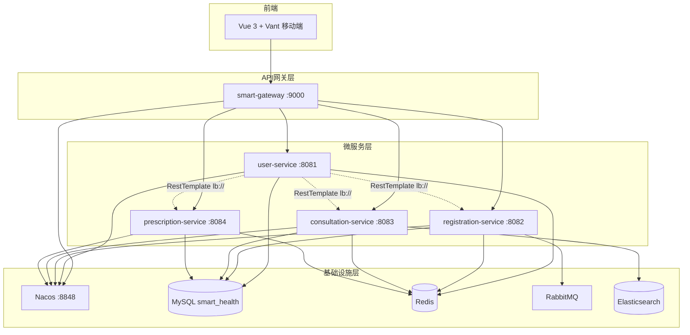
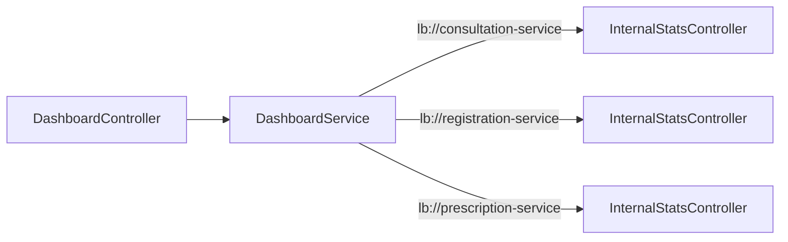
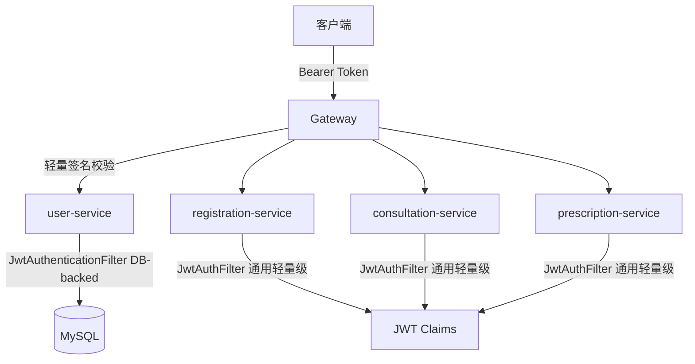

# 智能医疗平台系统说明

## 一、项目概述

智慧医疗与健康管理平台（Smart Health Platform）是一个面向患者、医生、药剂师和管理员的多角色医疗服务平台。系统采用 **Spring Boot 3 + Vue 3** 前后端分离架构，后端基于 **Spring Cloud 微服务架构** 拆分，提供用户认证、挂号预约、AI 智能问诊、处方管理等核心功能。

### 核心能力

- **患者端**：在线挂号（含秒杀抢号）、AI 智能问诊（支持多模态图片分析）、处方查看与 PDF 下载、个人健康管理
- **医生端**：排班管理、问诊会话管理、处方开具
- **药剂师端**：处方审核、药品库存管理
- **管理端**：患者管理、员工管理

---

## 二、系统架构

### 2.1 整体架构图



### 2.2 双模式运行

系统支持两种运行模式：

| 模式 | 启动入口 | 说明 |
|------|---------|------|
| **微服务模式** | 各服务独立 Application | 每个服务独立部署，通过 Gateway + Nacos 通信 |
| **单体模式** | `SmartHealthApplication`（app 模块） | 所有模块聚合为一个 JAR，用于开发调试或向后兼容 |

---

## 三、技术栈总览

### 3.1 后端技术栈

| 类别 | 技术 | 版本 |
|------|------|------|
| 基础框架 | Spring Boot | 3.2.5 |
| 微服务框架 | Spring Cloud | 2023.0.1 |
| 微服务套件 | Spring Cloud Alibaba | 2023.0.1.0 |
| API 网关 | Spring Cloud Gateway | 随 Spring Cloud 版本 |
| 服务注册发现 | Nacos | 2.3.0 |
| 安全框架 | Spring Security + JWT (JJWT) | 6.x / 0.12.5 |
| ORM | MyBatis | 3.0.3 |
| 分页插件 | PageHelper | 2.1.0 |
| 数据库 | MySQL | 8.0 |
| 缓存 | Redis | 7 |
| 消息队列 | RabbitMQ | 3.x |
| 搜索引擎 | Elasticsearch | 8.12.0 |
| AI 大模型 | Spring AI + 阿里云百炼 (通义千问) | 1.0.5 |
| 多模态 AI | 智谱 GLM-4V-Flash | - |
| API 文档 | Knife4j + SpringDoc OpenAPI 3 | 4.4.0 |
| 分布式ID | Redis + Lua 分布式序列号生成器 | 自研 |
| 工具库 | Hutool | 5.8.26 |
| 构建工具 | Maven | - |

### 3.2 前端技术栈

| 类别 | 技术 | 版本 |
|------|------|------|
| 框架 | Vue 3 | 3.4.x |
| 构建 | Vite | 5.2.x |
| UI 组件库 | Vant（移动端） | 4.8.x |
| 状态管理 | Pinia | 2.1.x |
| 路由 | Vue Router | 4.3.x |
| HTTP 客户端 | Axios | 1.7.x |
| Markdown 渲染 | marked + highlight.js | - |
| 语言 | TypeScript | 5.4.x |

---

## 四、模块结构说明

### 4.1 项目模块总览

```
smart-health-platform/
├── smart-health-common          # 公共基础模块
├── smart-health-user            # 用户服务
├── smart-health-registration    # 挂号预约服务
├── smart-health-consultation    # AI 问诊服务
├── smart-health-prescription    # 处方服务
├── smart-health-app             # 单体聚合启动模块（兼容模式）
├── smart-gateway                # API 网关
├── smart-health-frontend        # Vue 3 前端
├── sql/                         # 数据库初始化脚本
└── docker-compose.yml           # 基础设施编排
```

### 4.2 smart-health-common（公共模块）

所有业务模块的共享基础库，提供：

| 组件 | 说明 |
|------|------|
| `Result<T>` / `PageResult<T>` | 统一响应体封装 |
| `ResultCode` | 统一业务错误码枚举 |
| `BusinessException` | 统一业务异常 |
| `GlobalExceptionHandler` | 全局异常处理（`@RestControllerAdvice`） |
| `CommonConstants` | 通用常量（Token Header、前缀等） |
| `SecurityUtils` | 安全工具类，支持 DB-backed 和 JWT-only 双模式 |
| `PatientUserDetails` / `StaffUserDetails` | Spring Security 用户主体（DB-backed） |
| `JwtPrincipal` | 轻量级 JWT 认证主体（无 DB 依赖） |
| `JwtAuthFilter` | 通用 JWT 过滤器（条件启用） |
| `JwtAutoSecurityConfig` | 通用安全配置（条件启用） |
| `DistributedSequenceGenerator` | 基于 Redis + Lua 的分布式 ID 生成器 |

### 4.3 smart-health-user（用户服务 :8081）

负责用户认证、授权和账号管理，是系统中**唯一签发 JWT Token** 的服务。

| 组件 | 说明 |
|------|------|
| `AuthController` | 统一认证入口（患者注册/登录、员工登录） |
| `PatientAuthService` | 患者注册、登录、个人信息管理 |
| `StaffAuthService` | 员工（医生/药剂师/管理员）登录与管理 |
| `StaffController` | 员工 CRUD（管理员接口） |
| `AdminPatientController` | 患者管理（管理员接口） |
| `DashboardController` | 首页统计聚合（跨服务调用） |
| `DashboardService` | 通过 RestTemplate + Nacos 聚合各服务统计数据 |
| `JwtTokenProvider` | JWT Token 签发与解析 |
| `JwtAuthenticationFilter` | DB-backed JWT 过滤器（根据角色路由到对应 UserDetailsService） |
| `SecurityConfig` | user-service 专用安全配置（禁用通用 JwtAuthFilter） |
| `PatientDetailsService` / `StaffDetailsService` | Spring Security UserDetailsService 实现 |

**核心特性**：
- 通过 `jwt.auth.filter.enabled=false` 禁用 common 模块的通用 JwtAuthFilter，使用自己的 DB-backed 认证
- 签发 JWT 时写入 `userId`、`role`、`username`、`doctorId`（仅医生）到 Token claims
- `@LoadBalanced` RestTemplate 支持通过 Nacos 服务名调用其他微服务

### 4.4 smart-health-registration（挂号预约服务 :8082）

| 组件 | 说明 |
|------|------|
| `ScheduleController` | 排班管理（创建排班、查询科室/医生排班） |
| `DoctorController` | 医生信息查询 |
| `InternalStatsController` | 内部统计接口（供跨服务调用） |
| `ScheduleService` | 排班管理（含 Redis 缓存 + 号源库存管理） |
| `DoctorService` | 医生信息管理 |
| `RegistrationOrderService` | 挂号订单管理（含秒杀下单 + RabbitMQ 异步处理） |
| `RegistrationOrderConsumer` | RabbitMQ 消费者，异步创建挂号订单 |
| `RabbitMQConfig` | RabbitMQ 队列与交换机配置 |
| `ScheduleRedisConfig` | Redis 缓存配置 |

**核心特性**：
- **秒杀挂号**：基于 Redis 预扣库存 + RabbitMQ 异步下单，支持高并发场景
- 使用 `OrderSnGenerator` 生成唯一挂号单号

### 4.5 smart-health-consultation（AI 问诊服务 :8083）

| 组件 | 说明 |
|------|------|
| `AiConsultController` | AI 问诊入口（SSE 流式对话、会话管理、评价、图片分析） |
| `InternalStatsController` | 内部统计接口 |
| `SessionManager` / `SessionManagerImpl` | 问诊会话生命周期管理 |
| `ChatStream` / `ChatStreamImpl` | SSE 流式 AI 对话（基于 Spring AI） |
| `RagRetrievalService` | RAG 检索增强生成（Elasticsearch 向量检索） |
| `MultimodalService` | 多模态图片分析（智谱 GLM-4V） |
| `SessionAccessor` / `JpaSessionAccessor` | 会话数据访问层 |
| `SessionArchive` / `SessionArchiveImpl` | 会话归档与历史查询 |
| `MedicalKnowledgeInitializer` | 医学知识库种子数据初始化 |
| `ConsultationScheduledTasks` | 定时任务（自动关闭超时会话等） |

**核心特性**：
- **RAG 检索增强**：结合 Elasticsearch 向量检索医学知识库，增强 AI 回答的专业性
- **SSE 流式输出**：通过 Server-Sent Events 实时推送 AI 回复
- **多模态分析**：支持上传医学图片（如化验单），由智谱 GLM-4V 进行图像理解
- **知识库管理**：支持导入医学知识文档，自动向量化存入 Elasticsearch

### 4.6 smart-health-prescription（处方服务 :8084）

| 组件 | 说明 |
|------|------|
| `PrescriptionController` | 处方管理（开具、审核、查询、PDF 下载） |
| `InternalStatsController` | 内部统计接口 |
| `PrescriptionService` / `PrescriptionServiceImpl` | 处方业务逻辑 |
| `PdfGenerationService` | 处方 PDF 生成（基于 Thymeleaf 模板） |
| `PrescriptionCodeGenerator` | 处方编号生成器 |

**核心特性**：
- 处方全生命周期：开具 → 药剂师审核 → 发药
- PDF 处方单生成与下载
- 药品库存管理

### 4.7 smart-gateway（API 网关 :9000）

| 组件 | 说明 |
|------|------|
| `GatewayApplication` | 网关启动类（WebFlux 响应式） |
| `JwtAuthGlobalFilter` | 全局 JWT 签名校验过滤器 |

**路由规则**：

| 路径模式 | 目标服务 |
|---------|---------|
| `/api/v1/auth/**` | user-service |
| `/api/v1/staff/**` | user-service |
| `/api/v1/admin/patients/**` | user-service |
| `/api/v1/dashboard/**` | user-service |
| `/api/v1/schedule/**` | registration-service |
| `/api/v1/registration/**` | registration-service |
| `/api/v1/doctor/**` | registration-service |
| `/api/v1/ai/**` | consultation-service |
| `/api/v1/prescription/**` | prescription-service |
| `/api/v1/prescriptions/**` | prescription-service |
| `/api/v1/pharmacy/**` | prescription-service |

**白名单**：`/api/v1/auth/login`、`/api/v1/auth/register` 无需 Token。

### 4.8 smart-health-app（单体兼容模块）

保留原有的单体启动入口 `SmartHealthApplication`，聚合所有 4 个业务模块为一个 JAR。适用于：
- 本地开发调试
- 向后兼容旧的部署方式

---

## 五、微服务架构设计

### 5.1 服务注册与发现

所有微服务启动时自动注册到 **Nacos**（standalone 模式）：

```yaml
spring:
  cloud:
    nacos:
      discovery:
        server-addr: ${NACOS_SERVER_ADDR:localhost:8848}
```

服务名与端口映射：

| 服务名 | 模块 | 端口 |
|--------|------|------|
| `user-service` | smart-health-user | 8081 |
| `registration-service` | smart-health-registration | 8082 |
| `consultation-service` | smart-health-consultation | 8083 |
| `prescription-service` | smart-health-prescription | 8084 |
| `gateway-service` | smart-gateway | 9000 |

### 5.2 API 网关

Spring Cloud Gateway（基于 WebFlux 响应式模型）作为统一入口：

- **JWT 全局校验**：`JwtAuthGlobalFilter` 对所有请求进行轻量级 JWT 签名+过期校验（不访问数据库）
- **路由转发**：基于 Nacos 服务发现的 `lb://service-name` 负载均衡路由
- **全局 CORS**：统一跨域配置

### 5.3 服务间通信

唯一需要跨服务调用的场景是 **DashboardService**（首页统计聚合）：



- **调用方式**：`RestTemplate` + `@LoadBalanced` + Nacos 服务发现
- **内部接口**：每个服务暴露 `GET /internal/stats/count?patientId={id}` 端点
- **安全设计**：`/internal/**` 路径在 `JwtAutoSecurityConfig` 白名单中，无需 Token
- **容错处理**：任一服务调用失败时返回 0，不影响整体响应

### 5.4 JWT 认证架构



**三层 JWT 校验机制**：

| 层级 | 组件 | 校验方式 | 说明 |
|------|------|---------|------|
| 网关层 | `JwtAuthGlobalFilter` | WebFlux GlobalFilter，仅签名+过期 | 第一道防线，快速拦截无效 Token |
| user-service | `JwtAuthenticationFilter` | Servlet Filter，签名+DB 查询 UserDetails | 完整认证，支持角色路由 |
| 其他服务 | `JwtAuthFilter`（common） | Servlet Filter，仅签名+Claims 解析 | 从 Token 提取 JwtPrincipal，无 DB 依赖 |

**SecurityUtils 双模式兼容**：

`SecurityUtils` 通过 `instanceof` 分派同时支持两种认证主体：

- `PatientUserDetails` / `StaffUserDetails`：user-service 的 DB-backed 完整认证
- `JwtPrincipal`：其他微服务的轻量级认证（仅从 JWT claims 提取）

所有现有业务代码调用 `SecurityUtils.getCurrentPatientId()` 等方法时无需感知底层认证类型。

### 5.5 条件装配机制

common 模块的 `JwtAuthFilter` 和 `JwtAutoSecurityConfig` 通过 `@ConditionalOnProperty` 实现按需启用：

```java
@ConditionalOnProperty(name = "jwt.auth.filter.enabled", havingValue = "true", matchIfMissing = true)
```

| 服务 | `jwt.auth.filter.enabled` | 效果 |
|------|--------------------------|------|
| user-service | `false` | 禁用通用 Filter，使用自己的 DB-backed Filter |
| registration-service | 默认（`true`） | 启用通用 JwtAuthFilter |
| consultation-service | 默认（`true`） | 启用通用 JwtAuthFilter |
| prescription-service | 默认（`true`） | 启用通用 JwtAuthFilter |

---

## 六、安全认证体系

### 6.1 角色与权限

| 角色 | 权限标识 | 说明 |
|------|---------|------|
| 患者 | `ROLE_PATIENT` | 挂号、问诊、查看处方、首页统计 |
| 医生 | `ROLE_DOCTOR` | 排班管理、问诊管理、开具处方 |
| 药剂师 | `ROLE_PHARMACIST` | 处方审核、药品库存管理 |
| 管理员 | `ROLE_ADMIN` | 患者管理、员工管理 |

### 6.2 JWT Token 结构

```json
{
  "sub": "username",
  "userId": 123,
  "role": "PATIENT",
  "doctorId": null,
  "iat": 1719936000,
  "exp": 1720022400
}
```

- `userId`：用户 ID（患者 ID 或员工 ID）
- `role`：角色标识（PATIENT / DOCTOR / PHARMACIST / ADMIN）
- `doctorId`：关联医生 ID（仅 DOCTOR 角色有值）
- 有效期：24 小时

### 6.3 认证流程

1. **登录**：客户端 → Gateway → user-service `AuthController` → 验证密码 → 签发 JWT
2. **后续请求**：客户端 → Gateway（签名校验） → 目标服务（JwtAuthFilter 解析 Claims → SecurityContext）
3. **权限控制**：通过 `@PreAuthorize("hasRole('PATIENT')")` 等注解进行方法级权限校验

---

## 七、核心业务流程

### 7.1 患者注册与登录

```
患者注册 → PatientAuthService.register()
  ├── 检查用户名/身份证唯一性
  ├── BCrypt 加密密码
  └── 写入 patient 表

患者登录 → PatientAuthService.login()
  ├── 验证用户名密码
  ├── 检查账号状态
  └── JwtTokenProvider.generatePatientToken() → 返回 JWT
```

### 7.2 挂号预约（含秒杀）

```
患者选择排班 → 提交挂号请求
  ├── ScheduleService.seckill() → Redis 预扣号源库存
  ├── 生成 SeckillOrderMessage
  ├── 发送到 RabbitMQ (registration.seckill.queue)
  └── RegistrationOrderConsumer 异步消费
      ├── 创建 RegistrationOrder（MySQL）
      ├── 生成唯一订单号（OrderSnGenerator）
      └── 更新订单状态
```

### 7.3 AI 智能问诊

```
患者发起问诊 → AiConsultController
  ├── SessionManager.createSession() → 创建问诊会话
  ├── ChatStream.streamChat() → SSE 流式 AI 对话
  │   ├── RagRetrievalService.retrieve() → ES 向量检索医学知识
  │   ├── 构建增强 Prompt（上下文 + 检索结果）
  │   └── Spring AI → 阿里云百炼 API → 流式返回
  ├── 多模态分析（可选）→ MultimodalService → 智谱 GLM-4V
  └── 超时自动关闭（ConsultationScheduledTasks）
```

### 7.4 处方管理

```
医生开具处方 → PrescriptionController.issue()
  ├── PrescriptionCodeGenerator → 生成处方编号
  ├── 保存处方 + 处方明细（prescription / prescription_item 表）
  └── 状态：PENDING_AUDIT

药剂师审核 → PrescriptionController.audit()
  ├── 审核通过 → 状态：APPROVED → 扣减库存
  └── 审核拒绝 → 状态：REJECTED

患者查看 → 下载 PDF 处方单
  └── PdfGenerationService → Thymeleaf 模板渲染 → PDF 文件
```

---

## 八、数据模型

所有服务共享同一个 MySQL 数据库 `smart_health`，主要数据表：

### 8.1 用户域（user-service 管理）

| 表名 | 说明 | 核心字段 |
|------|------|---------|
| `patient` | 患者表 | id, username, password, real_name, id_card, phone, gender |
| `staff` | 员工表 | id, username, password, role, doctor_id |

### 8.2 挂号域（registration-service 管理）

| 表名 | 说明 | 核心字段 |
|------|------|---------|
| `doctor` | 医生信息表 | id, name, department, title, introduction |
| `doctor_schedule` | 医生排班表 | id, doctor_id, schedule_date, time_slot, total_count, remaining_count |
| `registration_order` | 挂号订单表 | id, order_sn, patient_id, doctor_id, schedule_id, status |

### 8.3 问诊域（consultation-service 管理）

| 表名 | 说明 | 核心字段 |
|------|------|---------|
| `consultation_session` | 问诊会话表 | id, patient_id, status, create_time |
| `consultation_turn` | 对话轮次表 | id, session_id, role, content |
| `consultation_rating` | 问诊评价表 | id, session_id, rating, comment |
| `medical_knowledge_document` | 医学知识文档 | id, title, content, embedding |

### 8.4 处方域（prescription-service 管理）

| 表名 | 说明 | 核心字段 |
|------|------|---------|
| `prescription` | 处方主表 | id, prescription_no, patient_id, doctor_id, audit_status, status |
| `prescription_item` | 处方明细表 | id, prescription_id, medicine_name, dosage, quantity |
| `pharmacy_inventory` | 药品库存表 | id, medicine_name, stock, unit_price |

---

## 九、中间件使用说明

### 9.1 MySQL

- **数据库**：`smart_health`（utf8mb4）
- **所有服务共享同一数据库**（微服务迁移中选择不拆分数据库）
- ORM：MyBatis + PageHelper 分页
- 命名规范：下划线自动转驼峰（`map-underscore-to-camel-case: true`）

### 9.2 Redis

| 使用场景 | 服务 | 说明 |
|---------|------|------|
| 号源库存预扣 | registration-service | 秒杀挂号场景，Lua 脚本原子操作 |
| 分布式 ID 生成 | common | Redis + Lua 序列号生成器 |
| 排班数据缓存 | registration-service | 减少数据库查询 |

### 9.3 RabbitMQ

| 队列 | 服务 | 说明 |
|------|------|------|
| `registration.seckill.queue` | registration-service | 挂号秒杀异步下单 |

流程：秒杀请求 → Redis 预扣 → 发送消息到 MQ → 消费者异步创建订单

### 9.4 Elasticsearch

| 使用场景 | 服务 | 说明 |
|---------|------|------|
| 医学知识库向量检索 | consultation-service | RAG 检索增强生成 |
| IK 分词器 | - | 中文医学文本分词 |

### 9.5 Nacos

- **模式**：standalone（单机部署）
- **用途**：服务注册与发现
- **端口**：8848（HTTP）、9848（gRPC）
- Gateway 通过 Nacos 实现 `lb://service-name` 负载均衡路由
- DashboardService 通过 Nacos 实现 `RestTemplate` 负载均衡调用

---

## 十、部署方案

### 10.1 Docker Compose 基础设施

```yaml
services:
  mysql:        # MySQL 8.0（端口 3306）
  redis:        # Redis 7（端口 6379）
  rabbitmq:     # RabbitMQ 3（端口 5672/15672）
  elasticsearch: # ES 8.12.0（端口 9200）
  nacos:        # Nacos 2.3.0（端口 8848/9848）
```

### 10.2 微服务启动顺序

1. **启动基础设施**：`docker-compose up -d`（MySQL、Redis、RabbitMQ、ES、Nacos）
2. **初始化数据库**：执行 `sql/init.sql`（docker-compose 自动挂载）
3. **启动各微服务**（可并行）：
   - user-service（8081）
   - registration-service（8082）
   - consultation-service（8083）
   - prescription-service（8084）
4. **启动网关**：smart-gateway（9000）
5. **启动前端**：`cd smart-health-frontend && npm run dev`

### 10.3 环境变量

| 变量名 | 默认值 | 说明 |
|--------|--------|------|
| `NACOS_SERVER_ADDR` | `localhost:8848` | Nacos 服务地址 |
| `JWT_SECRET` | Base64 编码密钥 | JWT 签名密钥（所有服务共享同一密钥） |
| `AI_API_KEY` | - | 阿里云百炼 API Key |
| `ZHIPU_API_KEY` | - | 智谱 AI API Key |
| `UPLOAD_PATH` | `/tmp/smart-health/uploads/` | 文件上传目录 |

### 10.4 端口分配

| 服务 | 端口 |
|------|------|
| smart-gateway | 9000 |
| user-service | 8081 |
| registration-service | 8082 |
| consultation-service | 8083 |
| prescription-service | 8084 |
| MySQL | 3306 |
| Redis | 6379 |
| RabbitMQ | 5672 / 15672 |
| Elasticsearch | 9200 |
| Nacos | 8848 / 9848 |

---

## 十一、微服务迁移说明

### 11.1 迁移前（单体架构）

原系统为 6 模块单体架构：

```
smart-health-app（启动入口）
  ├── smart-health-common
  ├── smart-health-user
  ├── smart-health-registration
  ├── smart-health-consultation
  └── smart-health-prescription
```

所有模块打包为一个 JAR，共享同一个进程和数据库连接池。

### 11.2 迁移后（微服务架构）

每个业务模块升级为独立可部署的微服务：
- 每个服务拥有独立的 `Application` 启动类
- 每个服务拥有独立的 `application.yml` 配置
- 每个服务通过 Nacos 注册和发现
- 统一通过 API Gateway 对外暴露接口

### 11.3 迁移中新增的关键文件

| 文件 | 位置 | 说明 |
|------|------|------|
| `JwtAuthFilter` | common/security | 通用轻量级 JWT 过滤器 |
| `JwtPrincipal` | common/security | JWT 认证主体（无 DB 依赖） |
| `JwtAutoSecurityConfig` | common/config | 通用安全配置（条件启用） |
| `GatewayApplication` | smart-gateway | 网关启动类 |
| `JwtAuthGlobalFilter` | gateway/filter | 网关全局 JWT 校验 |
| `UserApplication` | user-service | 用户服务启动类 |
| `RegistrationApplication` | registration-service | 挂号服务启动类 |
| `ConsultationApplication` | consultation-service | 问诊服务启动类 |
| `PrescriptionApplication` | prescription-service | 处方服务启动类 |
| `DashboardService` | user-service/service | 跨服务统计聚合 |
| `DashboardController` | user-service/controller | 首页统计接口 |
| `RestTemplateConfig` | user-service/config | 负载均衡 RestTemplate |
| `InternalStatsController` | 3 个服务各一份 | 内部统计端点 |

### 11.4 未实施的微服务标准

按项目需求（学校课程设计），以下标准未实施：

| 标准 | 原因 |
|------|------|
| 独立数据库（Database per Service） | 所有服务共享同一 `smart_health` 数据库 |
| 分布式配置中心 | 各服务使用本地 `application.yml` |
| 链路追踪 | 未集成 SkyWalking / Zipkin |
| 熔断限流 | 未集成 Sentinel / Resilience4j |

---

## 十二、测试

各模块均包含单元测试和集成测试：

| 模块 | 测试数 | 覆盖范围 |
|------|--------|---------|
| common | 5 | SecurityUtils 双模式认证 |
| user | 6 | PatientAuthService 注册/登录 |
| registration | 29 | ScheduleController、RegistrationOrderConsumer、SeckillOrderMessage |
| consultation | 22 | SessionAccessor、SessionManager、RagRetrieval、SSE 异常处理 |
| prescription | 31 | PrescriptionController、PrescriptionServiceImpl、PDF 生成、编号生成 |

运行命令：`mvn test`
